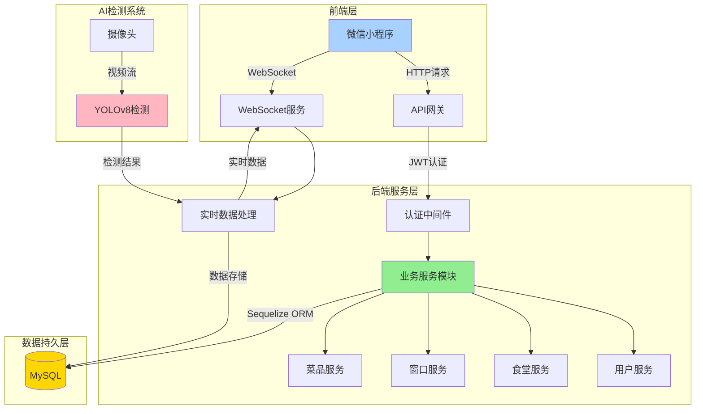

# 校园食堂小程序系统架构设计

## 系统整体架构

## 核心模块说明

### 1. 前端层
- **微信小程序**：用户交互界面，实现食堂信息展示、订单管理等功能
- **数据通信**：
  - 通过HTTP请求获取基础数据
  - 使用WebSocket实现实时数据更新

### 2. 后端服务层
- **API网关**：统一接口管理，处理请求路由
- **认证中间件**：实现JWT token验证
- **业务服务模块**：
  - 用户服务：处理登录注册、个人信息管理
  - 食堂服务：食堂信息管理、座位管理
  - 窗口服务：窗口状态、队列管理
  - 菜品服务：菜品信息、库存管理

### 3. AI检测系统
- **YOLOv8检测**：实时人体检测和计数
- **实时数据处理**：处理检测结果并推送更新

### 4. 数据持久层
- **MySQL数据库**：存储业务数据
- **Sequelize ORM**：数据库访问和模型管理

## 数据流说明

1. **用户认证流程**
   - 用户登录 -> JWT token生成 -> 后续请求携带token

2. **业务数据流程**
   - 客户端请求 -> API网关 -> 认证 -> 业务处理 -> 数据库操作

3. **实时数据流程**
   - 摄像头采集 -> YOLOv8检测 -> 结果处理 -> WebSocket推送 -> 前端展示

## 技术栈

- **前端**：微信小程序（WXML + WXSS + JavaScript）
- **后端**：Express.js + Node.js
- **数据库**：MySQL + Sequelize ORM
- **AI检测**：YOLOv8 + Python
- **实时通信**：WebSocket
- **认证**：JWT + bcrypt